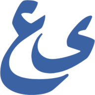
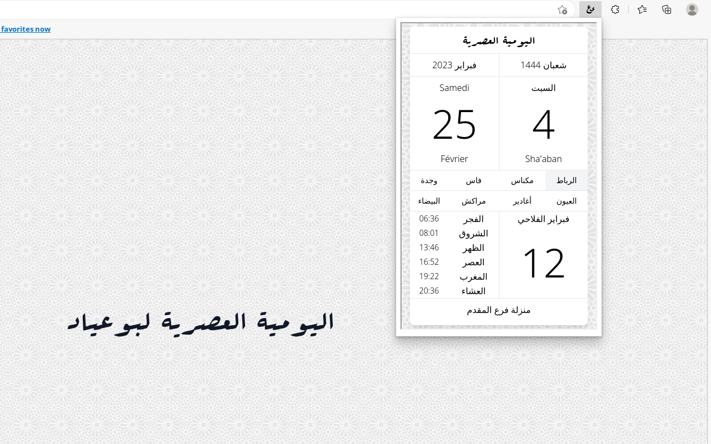

  

 
  
  
  
  
  
  

  
  
  

## Features
- All of mobile viewport features of [web.bouayad.app](https://github.com/moghwan/web.bouayad.app) as a popup

## Download
- A browser extension version is also made for a quicker access for these browsers:

| Mozilla Firefox | Microsoft Edge | Google Chrome |              Web               |
|:---------------:|:--------------:|:-------------:|:------------------------------:|
| [Mozilla Add-ons](https://addons.mozilla.org/firefox/addon/bouayadapp-%D8%A7%D9%84%D9%8A%D9%88%D9%85%D9%8A%D8%A9-%D8%A7%D9%84%D8%B9%D8%B5%D8%B1%D9%8A%D8%A9/) | [Edge Add-ons](https://microsoftedge.microsoft.com/addons/detail/bouayadapp-%D8%A7%D9%84%D9%8A%D9%88%D9%85%D9%8A%D8%A9-%D8%A7%D9%84%D8%B9%D8%B5/hjkanamopcgpejnjckfkocleokagaeak) | [Chrome web store](https://chrome.google.com/webstore/detail/bouayadapp-اليومية-العصري/homjiaebdnpmepkeiiipamadbbpkgcij) | [PWA](https://web.bouayad.app) |

## Screenshot

## Contributing
- The project is a simple iframe which [this repository](https://web.bouayad.app) is the source
- Any improvements or a feature request are greatly appreciated!
- If you want to contribute to the source page, please refer to the **contributing** section of the [corresponding project](https://github.com/moghwan/web.bouayad.app#contributing)

## Stay in touch
* Author - [Marwane Chaoui](https://twitter.com/moghwan)
* Website - [bouayad.app](https://bouayad.app)
* Twitter - [@BouayadApp](https://twitter.com/bouayadapp)

## License
See the [LICENSE](./LICENSE) file for licensing information
